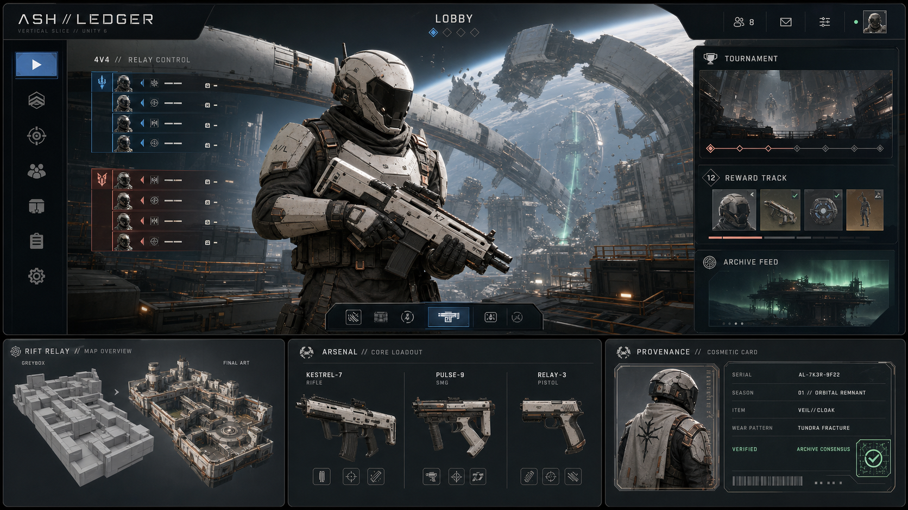

# 正式内容设计方案 v1.0

状态：首发方向已进入 Gate B 垂直切片制作；可用于概念验证、外包 Brief、UI 原型、地图 Greybox 和武器内容排期。

适用底层：`com.web3fps.game-foundation` 1.4.6。本文只定义游戏表现和内容，不改变现有安全边界：
战斗由权威服务器判定；Web3 仅管理所有权、来源、展示、奖励、赛事资金和结果存证；NFT 永不改变战斗数值。



> 概念板用于统一布局、材质、色彩、地图模块与武器轮廓，不是最终可直接切图的 UI 或生产资产。

## 当前实现映射（v1.4）

- `Tools > Web3 FPS > Create ASH LEDGER Vertical Slice` 生成两张可编辑场景。
- `AshLedgerLobby` 已使用 UI Toolkit 实现 PLAY / ARSENAL / VAULT / TOURNAMENTS / PROFILE 导航，并绑定 Mock Web3 状态。
- `RiftRelay` 已实现三路战斗灰盒、正式战斗 HUD、本地玩家/机器人、7 击杀与 5 分钟结算循环；v1.4.1
  加入断裂轨道环境背景、工业塔群、开放式平台、雾效、极光中继柱和阵营导视照明。
- KESTREL-7、PULSE-9、RELAY-3 已有第一版可编辑轮廓 Prefab；其余三把武器尚未制作。
- v1.4.2 已有独立 Coral 低多边形装甲角色、持枪装备和 Cobalt 第一人称双臂；完整骨骼动画与最终 FBX 尚未制作。
- 当前角色、武器、场景均为灰盒资产；高精度模型、动画、特效、音频、联网和真实后端仍属于后续 Gate。

## 1. 产品主张

工作代号：**ASH//LEDGER（灰烬账本）**。

一句话体验：玩家作为轨道废墟中的“证据回收员”，参加节奏紧凑的 4v4 竞技行动；每局首先是一场公平 FPS，
链上能力随后把有意义的赛事成绩、限量外观和物品来源变成可验证、可展示、可流通的个人历史。

核心差异不是“FPS 加钱包”，而是三层体验：

1. **枪战层**：低门槛、高信息清晰度、服务器权威，不依赖钱包和链。
2. **身份层**：武器表面、角色外壳、名片信号形成可识别的玩家身份，但不改变轮廓和强度。
3. **公共档案层**：赛事奖池、稀有物品来源和最终结果可验证；失败或延迟只影响验证标记，不影响游戏。

## 2. 不可破坏的设计原则

| 原则 | 设计结果 | 禁止事项 |
|---|---|---|
| FPS 优先 | 开枪、命中、移动、重生不访问 Web3 网关 | 战斗中弹钱包、等待 RPC、链确认后才结算胜负 |
| 默认可玩 | 游客和未绑定钱包玩家拥有完整默认装备 | 用钱包连接作为进入匹配的门槛 |
| 外观公平 | NFT 只改变材质、合规饰件、展示动画与非战斗音效 | 改伤害、射速、后坐力、命中盒、镜体尺寸、视野遮挡 |
| 服务端事实 | 服务器冻结外观快照并生成最终比赛结果 | 信任客户端自报 token、比分、名次或奖励资格 |
| 交易退居二线 | 市场入口位于 Vault 资产详情并跳转系统浏览器 | 把价格、涨跌、倒计时促销放在主大厅或战斗 HUD |
| 状态可解释 | pending、confirmed、failed、default 都有明确反馈 | 用无限 Loading 遮挡正常匹配或赛后页 |
| 创意可持续 | 内容由赛季主题、赛事印记和组合系统扩展 | 每件皮肤都依赖独立模型、独立 Shader 和独立逻辑 |

## 3. 世界观与美术语言

### 3.1 世界设定

旧时代的轨道城市在一次自治网络分裂后被切成多个“证明域”。城市中的设备、赛事记录和制造配方由公共档案保存，
玩家代表不同回收组织争夺能源与数据中继站。链在叙事中不是投机货币，而是不会被单一组织改写的公共档案。

每件 NFT 外观称为 **Relic（遗物）**：它有发行季、序列号、总量、来源和外观磨损记录。
每场已存证比赛称为 **Proof（证明）**：链上只保存最终结果哈希，不保存逐帧战斗、聊天或隐私数据。

### 3.2 视觉关键词

- 主体：轨道工业、冷峻粗野主义、陶瓷装甲、维护标记、模块化机械结构。
- 反差：旧世界的氧化金属与新档案系统的“极光线路”。
- 避免：满屏霓虹、币价图表、六边形滥用、现实交易所视觉、影响敌我识别的全息噪声。
- 材质层级：哑光陶瓷 45%、深色金属 30%、织物/橡胶 15%、能量与发光标记不超过 10%。

### 3.3 色彩系统

| 用途 | 色彩 | 约束 |
|---|---|---|
| 世界底色 | 石墨黑、冷灰、骨白、氧化铜 | 环境不抢敌人轮廓 |
| 友方 | 钴蓝 | 轮廓、姓名和目标标记同时使用形状编码 |
| 敌方 | 珊瑚橙红 | 禁止 NFT 覆盖敌我识别描边 |
| 已验证 | 极光绿 | 只表示已确认/已存证，不表示稀有或更强 |
| 处理中 | 琥珀黄 | 必须带文字或图标，不能只靠颜色 |
| 错误/已失效 | 暗红 | 不得遮挡“继续游戏”入口 |

### 3.4 角色与皮肤轮廓

- 首发只做一个共享战斗骨架，阵营差异由布料、肩甲图案和色带表现。
- 所有角色 NFT 必须通过统一 silhouette envelope：头肩宽度、躯干体积、腿部宽度不超过默认模型包络。
- 第一人称手臂与第三人称角色分别制作，但必须共享皮肤色板和材质参数。
- 稀有度来自工艺复杂度、来源和展示层，不来自更小体型、更暗材质或更难辨认的轮廓。

## 4. UI 信息架构

正式前端建议使用 Unity UI Toolkit 的 UXML/USS/C# 分层；战斗 HUD 可保留 uGUI，以便处理准星、受击方向和高频动画。
当前 IMGUI 只作为调试界面，不进入正式版本。

### 4.1 顶层导航

```text
启动
 ├─ 游客进入（默认装备，可完整匹配）
 └─ 账号登录
      └─ 可选钱包绑定

主大厅
 ├─ PLAY：普通匹配、训练、私人房
 ├─ ARSENAL：武器配置、射击场、外观预览
 ├─ VAULT：NFT 库存、来源、序列号、外部市场
 ├─ TOURNAMENTS：赛事列表、报名、奖池、领奖/退款
 └─ PROFILE：战绩、Proof、展示墙、设置
```

主大厅默认焦点永远是 `PLAY`，不是钱包、库存价值或市场。

### 4.2 主大厅布局

| 区域 | 内容 | 交互 |
|---|---|---|
| 左侧 20% | PLAY / ARSENAL / VAULT / TOURNAMENTS / PROFILE | 键鼠、手柄均能单向循环导航 |
| 中央 55% | 当前角色、装备武器、队伍成员、匹配状态 | 旋转预览；匹配后切换队伍状态 |
| 右侧 25% | 每日任务、赛事卡、待领奖励、服务状态 | Web3 异常只显示轻提示 |
| 底栏 | 账号、缩写钱包地址、网络区域、设置 | 未绑定时显示“可选绑定”，不显示红色警告 |

### 4.3 必做页面

| 页面 | 必须显示 | 主操作 | 降级行为 |
|---|---|---|---|
| 登录/游客 | 账号状态、隐私说明 | 进入游戏、登录 | 钱包服务不可用仍可游客进入 |
| 主大厅 | 队伍、模式、地图偏好、任务摘要 | 开始匹配 | 资产服务异常不禁用 PLAY |
| Arsenal | 武器角色、靶场入口、三个外观槽 | 配置默认武器、进入预览 | 远端资源失败加载默认材质 |
| Vault | confirmed/pending、serial、maxSupply、season、wear | 装备、查看来源、打开市场 | pending 禁止装备；已转出提示下局回退 |
| Tournament | 状态、人数、报名费、奖池、截止时间、分配规则 | 报名、赞助、领奖、退款 | 交易失败保留普通匹配入口 |
| 匹配确认 | 模式、地图、队伍、外观核验状态 | 接受/退出 | entitlement 失败显示“已使用默认外观” |
| 战斗 HUD | 生命、弹药、比分、时间、目标、击杀信息 | 战斗 | 完全不显示钱包、tokenId、链状态 |
| 赛后页 | 比分、名次、奖励、Proof 状态 | 继续、再来一局、查看详情 | 存证失败不遮挡比分和下一局 |
| 资产详情 | 3D 预览、来源、序列、内容哈希状态 | 装备、外部市场 | 市场打不开时仍可返回 Vault |

### 4.4 战斗 HUD

- 中央：准星和命中确认，最多两种瞬时反馈，不出现稀有度动画。
- 左下：生命/护甲；右下：弹药/武器；顶部：比分、计时和目标状态。
- 击杀信息只显示玩家名、标准武器图标和助攻；NFT 名称只允许在可关闭的赛前展示卡与赛后卡出现。
- 钱包、交易、奖励铸造、存证状态禁止进入战斗 HUD。
- 皮肤的枪口焰、曳光、音效必须限制在统一亮度、持续时间和可听距离范围内。

### 4.5 Web3 状态文案

| 底层状态 | 玩家文案 | 可用操作 |
|---|---|---|
| pending asset | 正在确认所有权 | 预览、刷新；不可装备 |
| confirmed asset | 所有权已确认 | 装备、展示、打开市场 |
| default fallback | 本局使用默认外观 | 正常进入对局、赛后重试刷新 |
| pending attestation | 战绩已保存，公开验证处理中 | 继续下一局、查看本地战绩 |
| attested | 战绩已公开验证 | 打开验证页、加入展示墙 |
| failed attestation | 战绩有效，公开验证稍后重试 | 继续游戏、查看原因摘要 |

## 5. 首发玩法与地图

### 5.1 首发范围

- 主要人数：4v4；团队规模小，便于首版联网、服务器成本和视觉识别。
- 核心模式：Team Deathmatch；目标模式：Relay Control。
- 单局目标：普通匹配 8–12 分钟；赛事采用相同规则模板，避免客户端维护第二套战斗逻辑。
- MVP 先做 1 张完整地图与 1 张灰盒测试图，内容版本扩展到 3 张正式地图。

### 5.2 通用地图指标

| 指标 | 目标 |
|---|---|
| 出生到首次交火 | 6–9 秒 |
| 出生到核心目标 | 10–14 秒 |
| 主要轮转 | 12–18 秒 |
| 常见交战距离 | 8–35 米 |
| 最长稳定视线 | 不超过 55 米，且至少有两处硬掩体切断 |
| 出生区出口 | 至少 2 个，不能被单一视线同时封锁 |
| 目标区入口 | 至少 3 个，其中一个高风险捷径 |
| 高度层 | 主要战斗两层，第三层只用于短时信息/侧翼优势 |

### 5.3 地图 01：断层中继站 / RIFT RELAY

首个垂直切片地图。坠毁在轨道环裂缝中的通信站，骨白陶瓷外壳与暴露的深色维修结构形成清晰分区。

- 结构：近似对称三路；中央中继室、外侧维护桥、下层冷却通道。
- 模式：TDM、Relay Control。
- 玩法：中央最快但暴露；外桥适合中远程；下层近战且可快速换侧。
- 视觉地标：断裂行星环、中央极光数据柱、红色应急闸门。
- Web3 叙事：目标是夺取本地 Proof 缓存，但对局中不产生链调用。

### 5.4 地图 02：暮光船坞 / DUSK DOCK

轨道货运港，巨型货柜、维修臂和透明气闸构成横向移动空间。

- 结构：非对称 2.5 路；进攻侧有快速货运带，防守侧有较短回防路线。
- 模式：Relay Control、限时赛事变体。
- 动态元素：货运门只按服务器固定时间表开闭，不接受玩家付费或链上资产影响。
- 视觉地标：低角度恒星光、橙色机械臂、蓝色气闸。

### 5.5 地图 03：零号档案馆 / NULL ARCHIVE

围绕冷却井建设的公共档案中心，强调垂直观察与短距离房间争夺。

- 结构：环形主层、两座跨井桥、四个小型档案室。
- 模式：TDM、Relay Control。
- 玩法：桥面提供信息但缺少持续掩体；房间适合霰弹枪和冲锋枪；环廊承担安全轮转。
- 视觉地标：深井光束、悬挂档案匣、已损坏的公共验证墙。

## 6. 武器内容

首发只做清晰的角色武器，不以大量同质枪械堆内容。所有数值来自服务器认可的 `WeaponDefinition`；
NFT 资源不得携带或覆盖伤害、射速、散布、后坐力、射程、换弹时间和碰撞数据。

| 代号 | 类型 | 角色 | 理想距离 | 表现关键词 |
|---|---|---|---|---|
| KESTREL-7 隼式 | 突击步枪 | 通用基准，稳定连续射击 | 12–32m | 陶瓷上机匣、机械闭锁提示 |
| PULSE-9 脉冲 | 冲锋枪 | 快速侧翼、近距压制 | 5–18m | 紧凑电容匣、短促节拍音 |
| WITNESS 见证者 | 精确射手步枪 | 中远程点射与信息位 | 22–50m | 细长导轨、档案刻度 |
| BREACH-12 破门者 | 霰弹枪 | 房间突破、惩罚错误站位 | 2–10m | 粗壮泵动结构、清晰装填反馈 |
| ANCHOR 锚式 | 轻机枪 | 占点持续火力、移动受限 | 15–38m | 外露散热片、重量感动作 |
| RELAY-3 中继 | 半自动手枪 | 所有配置的可靠副武器 | 4–20m | 极简框架、单手检视动作 |

首个可玩迭代只实现 KESTREL-7、PULSE-9、RELAY-3；其余在地图节奏验证后进入生产。

### 6.1 外观包允许改变

- PBR 材质、色板、贴花、磨损遮罩和受控发光区域。
- 不超出默认轮廓包络的小型装饰件。
- 检视动画、大厅展示姿势、装备入场音和赛后卡片动画。
- 在统一可读性预算内的枪口焰/曳光颜色变体。

### 6.2 外观包禁止改变

- 武器碰撞体、镜体遮挡面积、第一人称占屏面积和枪口位置。
- 开火/换弹/切枪动画的有效时长。
- 枪声可听距离、方向辨识、音量优势或消音效果。
- 准星、命中反馈、敌我描边、烟雾透明度和热成像能力。
- 任何战斗数值、网络预测参数或服务器命中规则。

## 7. NFT 内容体系

当前三个 loadout 槽定义为：

1. `Slot 0 — Weapon Finish`：当前主武器外观。
2. `Slot 1 — Operator Shell`：角色材质、合规饰件和第一人称手臂。
3. `Slot 2 — Identity Signal`：赛前名片、击杀卡边框、赛后展示动作和个人旗帜。

### 7.1 现有字段的玩家价值

| 字段 | UI/创意含义 | 规则 |
|---|---|---|
| `tokenId` | 资产唯一编号 | 全程十进制字符串；UI 只显示首尾缩写，详情页可复制 |
| `skinDefId` | 本地内容目录键 | 决定资源包，不决定战斗数值 |
| `serial / maxSupply` | `#042 / 500` 的限量来源 | 不制造战斗优势，也不承诺价格 |
| `wear` | “使用痕迹”材质遮罩 | 只改变擦痕/涂层；玩家可关闭显示，不降低性能 |
| `rarity` | 工艺层级和获得难度 | 只影响卡框、材质复杂度和展示特效 |
| `seasonId` | 赛季来源 | 用于系列筛选和档案时间线 |
| `contentHash` | 下载资源完整性 | 不一致立即加载默认资源并告警 |
| `state` | pending/confirmed | 只有 confirmed 可进入正式 loadout |

### 7.2 三个有创意且可实施的 Web3 功能

#### A. Proofmark 赛事印记

玩家在已存证赛事中取得名次后，可获得一个纯展示印记。印记显示赛事 ID、名次区间和结果哈希缩写，
可装在 Identity Signal 或武器检视页。它证明“发生过”，但不展示完整钱包历史，也不改变武器强度。

#### B. Living Patina 使用痕迹

`wear` 驱动皮肤表面的细微磨损、修补贴和边缘抛光。变化由后端根据已验证使用记录生成，资源版本通过
`contentHash` 校验。玩家可以选择“原始状态/当前痕迹”，避免磨损成为强迫性价值下降机制。

#### C. Community Forge 社区铸造季

赛事主办方提交色板、贴花和故事说明，由项目方审核后组合现有模块，形成限量赛季系列。赞助和报名走现有
Tournament 流程；美术内容仍由白名单目录发布，任何用户输入都不能直接进入客户端 Shader、脚本或资源包。

### 7.3 不进入 MVP 的功能

- 游戏内完整交易所、拍卖、订单簿和价格图。
- 押注、开箱、随机付费铸造、代币收益承诺。
- NFT 租赁带来的排位资格或战斗特权。
- 每次击杀/移动都上链，或把录像和隐私数据永久公开。

## 8. 资源与技术方案

### 8.1 渲染与 UI

- 正式视觉基线：Unity 6 + URP，先以 PC 1080p/60fps 中档配置为临时性能目标。
- 前端页面：UI Toolkit，UXML 管结构、USS 管主题、C# Presenter 绑定现有 Session/Service。
- 战斗 HUD：可用 uGUI；只订阅战斗状态，不引用 Web3 网关。
- 皮肤：共享 Shader Graph 主材质，通过参数、贴图集和合规附加件组合，避免每个 NFT 独立 Shader。
- 远端 Bundle：先验证 `contentHash`，再实例化；失败加载本地默认资源。

Unity 6 UI Toolkit 与 URP 依据：

- [Unity 6 UI Toolkit 介绍](https://docs.unity3d.com/cn/6000.0/Manual/ui-systems/introduction-ui-toolkit.html)
- [Unity 6 运行时 UI 入门](https://docs.unity3d.com/cn/current/Manual/UIE-get-started-with-runtime-ui.html)
- [Unity 6 URP 手册](https://docs.unity3d.com/cn/6000.0/Manual/universal-render-pipeline.html)

### 8.2 首个垂直切片资产清单

| 类别 | 交付内容 |
|---|---|
| UI | 主题 Token、字体层级、18–24 个基础图标、主大厅/Arsenal/Vault/赛后 UXML 原型 |
| 角色 | 共享骨架 1 套、默认角色 2 个阵营色版、第一人称手臂 1 套 |
| 武器 | KESTREL-7、PULSE-9、RELAY-3；默认材质 + 4 个验证皮肤 |
| 地图 | RIFT RELAY 完整 Greybox、模块化墙/地/门/掩体套件、3 个地标模块 |
| VFX | 枪口焰、弹着、受击、复活、目标区、已验证展示特效 |
| Audio | 三把武器、脚步材质、命中/击杀、UI 确认/失败、大厅氛围 |
| Web3 展示 | 资产卡、Proofmark、serial/maxSupply、wear 对比、存证状态组件 |

## 9. 制作分期

### Gate A — 视觉与体验基线

- 确定工作名、Logo 方向、色彩、字体、角色轮廓和 RIFT RELAY 平面图。
- 在 UI Builder 完成主大厅、Vault、赛后页低保真原型。
- 在 Greybox 中验证 4v4 路线指标，暂不做高模和 NFT 特效。

### Gate B — 正式垂直切片

- RIFT RELAY 达到可读的模块化美术质量。
- 三把武器完成第一/第三人称、动画、音效和服务器数值定义。
- 正式 UI 接入 `Web3LobbySession`、`AuthoritativeMatchSession` 和 MatchResult。
- 四个 NFT 外观覆盖 confirmed、pending、已转出和 hash 失败状态。

### Gate C — 首发内容

- 三张地图、六把武器、两个模式通过联网与性能验证。
- 至少 24 个外观内容：8 个 Weapon Finish、8 个 Operator Shell、8 个 Identity Signal。
- 赛事报名、赞助、结算、领奖、退款和 Proof 状态完成端到端联调。

### Gate D — 社区与赛季

- Community Forge 使用白名单模块生产第一季内容。
- 上线赛季档案、展示墙和可验证赛事印记。
- 基于留存、地图热力和武器选择率调整内容，不根据 NFT 价格调整战斗强度。

## 10. 验收标准

### 10.1 UI

- 键鼠与手柄均可从启动页进入普通匹配，不需要钱包。
- Web3 服务断开时，PLAY、训练、设置和赛后比分仍可使用。
- 所有异步状态都有明确文案、取消/返回路径和超时处理。
- 关键文字与背景达到可读对比度；敌我、pending/confirmed 不只依赖颜色。

### 10.2 地图与武器

- 4v4 实测满足首次交火、轮转、视线和出生安全指标。
- 每个目标区至少三条进入路线，任何单点不能长期封锁两个出生出口。
- 所有 NFT 外观在第一/第三人称遮挡、枪口、动画时长、音量和碰撞体上与默认资源等价。
- 默认外观和所有稀有度在敌我识别、暗区可见性和色盲模式下均通过测试。

### 10.3 Web3

- 未绑定钱包、RPC 失败、资产后端失败都能使用默认外观进入普通对局。
- pending 和未拥有资产不可装备；服务器核验失败会冻结默认 snapshot。
- tokenId 始终是字符串，UI 不执行整数转换。
- contentHash 不一致不加载资源包。
- 存证 pending/failed 不阻断赛后页或下一局；同 matchId 不发布冲突结果。
- 资产、赛事和交易页面均说明外部跳转、网络费用和风险，不承诺升值。

## 11. 当前代码到正式内容的映射

| 当前实现 | 正式替代/扩展 |
|---|---|
| `PrototypeHud` / `Web3LobbyHud` IMGUI | UI Toolkit 前端 + uGUI 战斗 HUD |
| 方形 Prototype Arena | RIFT RELAY Greybox，然后模块化美术替换 |
| 单一 `HitscanWeapon` | `WeaponDefinition` 目录 + 六种武器角色，仍通过权威 ShotCommand |
| 三个 token 槽 | Weapon Finish / Operator Shell / Identity Signal |
| `SkinItem` 数字字段 | Vault 来源卡、限量序列、赛季、使用痕迹和完整性状态 |
| `MatchResult` + hash | 赛后 Proof 状态、验证页入口和赛事印记 |
| Tournament Mock/HTTP | 正式赛事卡、报名/赞助/领奖/退款流程 |

本文确认设计方向，但不代表这些正式资产已经制作完成。每个 Gate 只有在 Unity 场景、资源、运行时 UI、
联网测试和 Web3 降级测试都有证据时才能标记完成。
